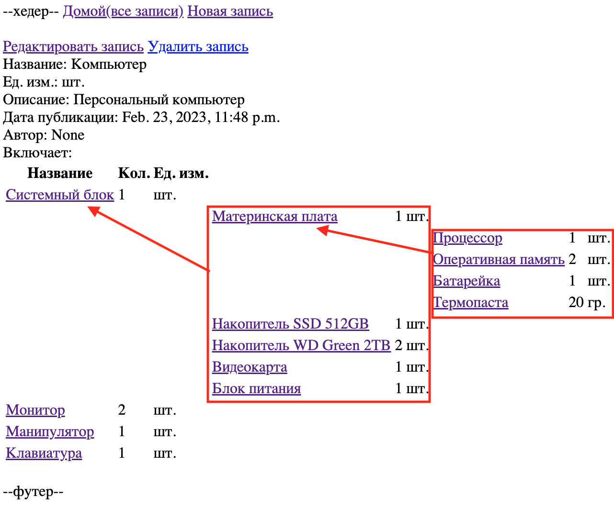

# Сборочник
Проект пилится и фукционирует тестово. Фронт минималистичен.



## Описание проекта
Можем создавать эелемент в который включать другие элементы в необходимом количестве. Таким образом мы можем генерировать сборочный. Вложенность неограничена.  
Например:  
Комптьютер включаетяет в себя: Монитор 1шт., Системный блок 1шт., Клавиатура 1шт.  
В свою очередь Системный блок включает в себя: Материнка 1шт., Процессор 1шт. Накопитель 4шт. Видеокарта 1шт.  
Далее мы можем например наполнить Материнку (если мы сами её собираемся паять ;)).  
(в примере на картинке процессор, оперативная память и термопаста включены в материнскую плату для наглядности вложенности)  

## Технологии
- Python
- Django

## Надо прикрутить
- Авторизацию. (+)
- Выгрузку таблицы. (Придумать как лучше)
- Сортировки
- Поиски
- Пагинацию

## Setup:
Клонируйте репозиторий
```
git clone git@github.com:dimabaril/warehouse_assembly.git
```
Перейдите в каталог warehouse
```
cd warehouse_assembly
```
Cоздайте виртуальное окружение:
```
Python -m venv venv
```
Подключите виртуально окружение
```
source venv/bin/activate
```
Установите зависимости
```
pip install -r requirements.txt
```
Зайдите в 
```
cd warehouse
```
Примените миграции:
```
python manage.py migrate
```
Создать суперпользователя Django:
```
python manage.py createsuperuser
```
Можно запускать
```
python manage.py runserver
```
доступен по адресу : http://127.0.0.1:8000/, http://localhost:8000/  
есть админка /admin  
будет допиливаться )  
## Ура всё работает!!!
## Автор:
Дмитрий Барилкин  
Смело пишите по любым вопросам и предложениям. )
Критикуйте!!!
